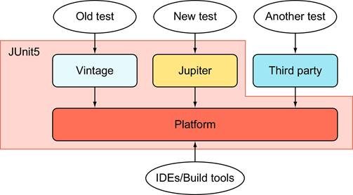

# Guia JUnit 5 e Mockito

# JUnit5

O JUnit 5 é um framework de teste para Java que apresenta uma arquitetura modular e extensível. Ele é composto por três partes principais: a **Plataforma JUnit** (JUnit Platform), o **JUnit Vintage** e o **JUnit Jupiter**.

<p align="center">
  
</p>

## Plataforma JUnit (JUnit Platform)

A Plataforma JUnit é a base do JUnit 5 e fornece o ambiente de execução para rodar testes escritos no JUnit Jupiter e no JUnit Vintage. Ela é projetada para ser altamente extensível e suportar várias linguagens de programação além do Java.

### Principais Características da Plataforma:

- **Extensibilidade**: A Plataforma JUnit permite que você crie extensões personalizadas para estender sua funcionalidade. Isso é útil para integrações com ferramentas de build, sistemas de CI/CD e muito mais.

- **Suporte Multilíngue**: Embora seja principalmente usada com Java, a Plataforma JUnit pode suportar outros idiomas, tornando-a versátil para projetos multilíngues.

- **Console de Teste**: A Plataforma inclui um Console de Teste que facilita a execução de testes, a visualização de relatórios e a integração com IDEs e ferramentas de build.

## JUnit Vintage (Testes Antigos)

O JUnit Vintage é um módulo do JUnit 5 que permite a execução de testes escritos nas versões antigas do JUnit, como JUnit 3 e JUnit 4. Isso é útil quando você tem um código legado com testes escritos nessas versões e deseja migrar gradualmente para o JUnit 5 sem reescrever todos os testes.

### Principais Características do JUnit Vintage:

- **Compatibilidade**: Permite que testes legados escritos em versões anteriores do JUnit sejam executados no ambiente do JUnit 5 sem nenhuma modificação.

- **Coexistência**: Você pode usar o JUnit Vintage ao lado do JUnit Jupiter, permitindo a execução de testes antigos e novos simultaneamente.

- **Configuração Flexível**: O JUnit Vintage oferece configurações flexíveis para adaptar a execução de testes antigos às necessidades do projeto.

## JUnit Jupiter (Testes Novos)

O JUnit Jupiter é o módulo de testes modernos do JUnit 5 e é projetado para oferecer recursos avançados e flexibilidade para a criação de testes em Java. Ele introduz um novo modelo de programação de testes, com um conjunto expandido de anotações e recursos.

### Principais Características do JUnit Jupiter:

- **Anotações Avançadas**: O JUnit Jupiter introduz novas anotações como `@Test`, `@BeforeEach`, `@AfterEach`, `@BeforeAll`, `@AfterAll`, `@ParameterizedTest`, entre outras, que tornam a criação e configuração de testes mais flexível e legível.

- **Asserções Avançadas**: Oferece uma ampla variedade de métodos de asserção, incluindo `assertAll`, `assertTimeout`, `assertThrows` e outros, para verificar condições complexas com precisão.

- **Testes Parametrizados**: Suporta testes parametrizados, onde um mesmo teste pode ser executado com diferentes conjuntos de dados de entrada.

- **Extensões (Extensions)**: Permite estender o framework com extensões personalizadas para adicionar funcionalidades específicas ao ambiente de teste.

Em resumo, a arquitetura do JUnit 5 é modular e flexível, permitindo que você escolha a parte adequada para suas necessidades. A Plataforma JUnit é a base que suporta as outras partes, o JUnit Vintage permite a execução de testes antigos e o JUnit Jupiter oferece recursos avançados para a criação de testes modernos em Java. Essa estrutura modular torna o JUnit 5 uma escolha poderosa para testar aplicativos Java em diversas situações.

## Pontos Importantes do JUnit 5

### 1. **Anotações**
   O JUnit 5 introduziu um novo conjunto de anotações que simplificam a criação e configuração de testes. Além das antigas anotações como `@Test`, novas anotações como `@BeforeEach`, `@AfterEach`, `@BeforeAll` e `@AfterAll` oferecem maior controle sobre o ciclo de vida dos testes.

`@BeforeEach e @AfterEach`
As anotações @BeforeEach e @AfterEach são usadas para configurar o estado antes e depois de cada método de teste. O método marcado com @BeforeEach é executado antes de cada teste, enquanto o método marcado com @AfterEach é executado após cada teste. Isso é útil para preparar o ambiente de teste e limpar recursos após a execução de cada teste.

```java
@BeforeEach
void configurarAntesDoTeste() {
    // Configurações antes de cada teste
}

@AfterEach
void limparDepoisDoTeste() {
    // Limpeza após cada teste
}
```

`@BeforeAll e @AfterAll`
As anotações @BeforeAll e @AfterAll são usadas para configurar o estado antes e depois de todos os métodos de teste na classe. O método marcado com @BeforeAll é executado uma única vez antes da execução de todos os testes na classe, enquanto o método marcado com @AfterAll é executado uma única vez após a execução de todos os testes. Isso é útil para configurações globais e limpezas.

```java
@BeforeAll
static void configurarUmaVezAntesDeTodosOsTestes() {
    // Configurações globais antes de todos os testes
}

@AfterAll
static void limparUmaVezDepoisDeTodosOsTestes() {
    // Limpeza global após todos os testes
}
```

### 2. **Métodos Estáticos**
   Ao contrário do JUnit 4, o JUnit 5 permite que métodos de configuração, como `@BeforeAll` e `@AfterAll`, sejam métodos estáticos. Isso facilita o uso de métodos de configuração sem a necessidade de criar uma instância da classe de teste.

   Exemplo:
   ```java
   @BeforeAll
   static void inicializar() {
       // Configuração antes de todos os testes
   }
   ```

### 3. **Testes Parametrizados**
   O JUnit 5 oferece suporte nativo para testes parametrizados, onde você pode executar o mesmo teste com diferentes conjuntos de dados de entrada. Isso ajuda a reduzir a duplicação de código e torna os testes mais abrangentes.

   Exemplo:
   ```java
   @ParameterizedTest
   @ValueSource(ints = {1, 2, 3})
   void meuTesteParametrizado(int valor) {
       // Teste com valores diferentes
   }
   ```

### 4. **Extensões (Extensions)**
   As extensões permitem que você estenda a funcionalidade do JUnit 5 com plugins personalizados. Isso é útil para adicionar recursos específicos ao seu ambiente de teste, como banco de dados temporários ou simulações de serviços.

### 5. **Asserções Avançadas**
   O JUnit 5 fornece um conjunto de métodos de asserção avançados, permitindo verificar condições complexas com clareza e precisão. Além das asserções básicas, você pode usar asserções como `assertAll`, `assertTimeout`, `assertThrows` e outras.

#### `assertTimeout`
A asserção assertTimeout permite que você verifique se um determinado bloco de código é executado dentro de um período de tempo especificado. Isso é útil para verificar se uma operação não está demorando muito para ser concluída.

```java
assertTimeout(Duration.ofSeconds(5), () -> {
    // Código que deve ser executado em menos de 5 segundos
});
```

#### `assertThrows`
A asserção assertThrows verifica se uma exceção específica é lançada durante a execução de um bloco de código. Isso é útil para testar cenários em que você espera que uma exceção seja lançada.

```java
assertThrows(MinhaExcecao.class, () -> {
    // Código que deve lançar MinhaExcecao
});
```

#### `assertEquals, assertTrue, assertFalse, assertNull, assertNotNull`
Essas são asserções simples que você pode usar para verificar se valores são iguais, verdadeiros, falsos, nulos ou não nulos, respectivamente.

```java
assertAll(
    () -> assertEquals(valorEsperado, resultado),
    () -> assertTrue(condicao),
    () -> assertFalse(condicao),
    () -> assertNull(objetoNulo),
    () -> assertNotNull(objetoNaoNulo)
);
```

#### `assertNotEquals`
A asserção `assertNotEquals` é usada para verificar se dois valores não são iguais. Ela é útil quando você espera que dois valores sejam diferentes um do outro.

```java
assertNotEquals(valorEsperado, resultado);
```

#### `assertArrayEquals`
A asserção assertArrayEquals é usada para verificar se dois arrays são iguais. Isso inclui a comparação de elementos do array.

```java
assertArrayEquals(arrayEsperado, arrayResultado);
```

#### `assertSame`
A asserção assertSame verifica se dois objetos têm a mesma referência na memória. Isso significa que eles são o mesmo objeto em termos de instância.

```java
assertSame(objetoEsperado, objetoResultado);
```

#### `assertNotSame`
A asserção assertNotSame é o oposto de assertSame. Ela verifica se dois objetos têm referências diferentes na memória, ou seja, não são o mesmo objeto.

```java
assertNotSame(objetoEsperado, objetoResultado);
```

### 6. **Testes de Repetição**
   Com a anotação `@RepeatedTest`, você pode executar um teste várias vezes com diferentes repetições. Isso é útil para testes que precisam ser validados em diferentes cenários ou com grande volume de dados.

   Exemplo:
   ```java
   @RepeatedTest(3)
   void meuTesteRepetido() {
       // Teste repetido três vezes
   }
   ```

### 7. **Integração com IDEs**
O JUnit 5 é amplamente suportado por várias IDEs, como Eclipse, IntelliJ IDEA e Visual Studio Code. Ele oferece integração perfeita para execução de testes, relatórios e depuração.

O JUnit 5 é uma poderosa ferramenta para a prática de Test-Driven Development (TDD) e para garantir a qualidade do código Java. Com suas melhorias e recursos avançados, torna o processo de teste mais eficiente e eficaz.

Lembre-se de incluir o JUnit 5 como uma dependência em seu projeto Java para começar a tirar proveito de seus recursos.

`Additional Maven Dependencies`

```xml
<!-- ... -->
<dependencies>
    <!-- Only needed to run tests in a version of IntelliJ IDEA that bundles older versions -->
    <dependency>
        <groupId>org.junit.platform</groupId>
        <artifactId>junit-platform-launcher</artifactId>
        <scope>test</scope>
    </dependency>
    <dependency>
        <groupId>org.junit.jupiter</groupId>
        <artifactId>junit-jupiter-engine</artifactId>
        <scope>test</scope>
    </dependency>
    <dependency>
        <groupId>org.junit.vintage</groupId>
        <artifactId>junit-vintage-engine</artifactId>
        <scope>test</scope>
    </dependency>
</dependencies>
<dependencyManagement>
    <dependencies>
        <dependency>
            <groupId>org.junit</groupId>
            <artifactId>junit-bom</artifactId>
            <version>5.10.0</version>
            <type>pom</type>
            <scope>import</scope>
        </dependency>
    </dependencies>
</dependencyManagement>
```

Para obter mais informações, consulte a [dependência JUnit5](https://junit.org/junit5/docs/current/user-guide/#running-tests).

---

Vale ressaltar que foram abordados alguns dos pontos mais importantes do JUnit 5, mas há muito mais para explorar neste framework de teste. O JUnit 5 oferece uma ampla gama de recursos para atender às necessidades de testes de qualquer projeto Java.

### Para obter mais informações, consulte a [documentação JUnit5](https://junit.org/junit5/).

# Mockito

O Mockito é uma biblioteca amplamente utilizada para criar e gerenciar objetos simulados (mocks) em testes de unidade em Java. Ele permite simular o comportamento de objetos reais em um ambiente de teste, facilitando a escrita de testes mais eficazes e isolados.

## Principais Recursos

O Mockito oferece uma série de recursos e funcionalidades importantes para simplificar o teste de componentes Java:

### 1. Criação de Mocks

O Mockito permite criar mocks de interfaces, classes abstratas e até mesmo classes finais. Isso permite isolar o componente sob teste de suas dependências.

```java
// Exemplo de criação de um mock de uma interface
MyInterface myMock = Mockito.mock(MyInterface.class);
```

### 2. Configuração de Comportamento

Você pode configurar o comportamento de um mock usando o método `when` para especificar o que o mock deve fazer quando determinados métodos são chamados.

```java
when(myMock.metodo()).thenReturn(valorEsperado);
```

### 3. Verificação de Interações

Você pode verificar se determinados métodos de um mock foram chamados e quantas vezes foram chamados. Isso é útil para garantir que seu código esteja se comportando conforme o esperado.

```java
verify(myMock, times(1)).metodo();
```

### 4. Captura de Argumentos

O Mockito permite capturar os argumentos passados para um mock durante a chamada de um método. Isso é útil para verificar os valores passados para o mock.

```java
ArgumentCaptor<Integer> captor = ArgumentCaptor.forClass(Integer.class);
verify(myMock).metodo(captor.capture());
```

### 5. Matchers

O Mockito oferece uma variedade de matchers que facilitam a verificação de argumentos em chamadas de métodos. Por exemplo, você pode usar `any()`, `eq()`, `isNull()`, entre outros.

```java
when(myMock.metodo(eq(valorEsperado))).thenReturn(resultado);
```

## Usando o Mockito

Para começar a usar o Mockito em seus testes, você deve incluir a dependência adequada em seu projeto. Em seguida, você pode criar mocks, configurar comportamentos, invocar métodos e verificar interações conforme necessário.

Lembre-se de que o Mockito é uma ferramenta poderosa, mas deve ser usado com sabedoria. Use mocks para isolar as partes do código que você está testando, mas não exagere, pois o uso excessivo de mocks pode tornar seus testes menos eficazes.

Com o Mockito, você pode escrever testes de unidade robustos e eficazes que garantem o bom funcionamento do seu código Java.

**Isso fornece uma visão geral das principais características e usos do Mockito em testes de unidade Java. Você pode adaptar e estender esta explicação de acordo com suas necessidades específicas.**

### Para obter mais informações, consulte a [documentação Mockito](https://site.mockito.org/).

## Autor
### **Documentação feita por:** `Daniel Penelva de Andrade`

